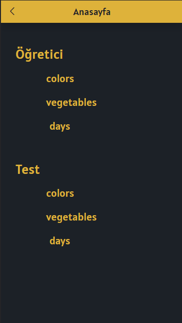

# What is the Natlang?
I long time ago I coded a project. I wanted to share this project with everyone. It's an easy project, but it can be useful for beginners. The project includes Turkish and English.

The project includes both tutorials and quizzes.
* Tutorials
* Quizzes (Online test)

# What was used?
- HTML
- CSS
- Vue JS

# Sorry
Sorry for my English is low level. So I wrote it using simple English. I learning English and I think I will solve this problem soon.

# Screenshots

  
  
  

